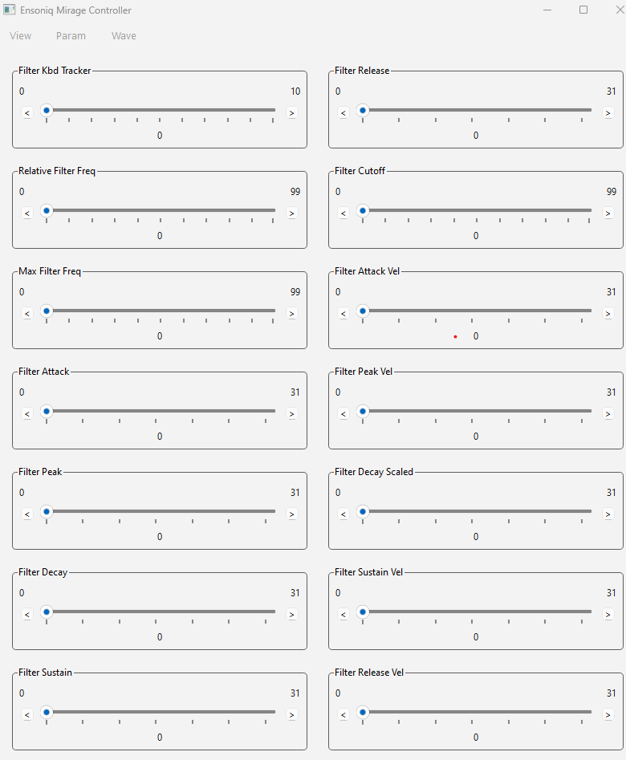

## 1. QT and Pyside6: [PythonGUIs](https://www.pythonguis.com) GUI applications with Python

First thing I needed to do to was figure out how to build the sliders in the template [MirageProgramTemplate.png](./Mirage-docs/MirageProgramTemplate.png). After much searching and trying out Maui and some others decided on Pyside6.




### Steps to install development environment
1. Install the qt framework from [Qt Software Downloads](https://www.qt.io/download-dev)
2. Install [pyenv](https://github.com/pyenv/pyenv) so you can more easily switch versions of Python when needed.
3. Use pyenv to install Python 3.12.0 (3.13 is newer but doesn't support rtmidi yet) 
4. Use python to install the other prerequisites using `pip install pyside6`, etc...
5. Install VS Code from [Download](https://code.visualstudio.com/download) for your system. It's a large IDE with a lot of functionality, but well supported.

### Why QT and Python?
1. I chose Python because I needed to learn it for a new position I'm starting in December, 2024
2. I chose QT because it provides professional quality User Interfaces with a Python wrapper called PySide6 for easy programming and is cross platform, meaning one program works on Linux, Windows and Mac OS laptops, a requirement for musicians is Windows and Mac OS.
4. Note I implemented this UI in Python using [QT Widgets](https://doc.qt.io/qtforpython-6/PySide6/QtWidgets/index.html), and not [QML](https://doc.qt.io/qtforpython-6/tutorials/basictutorial/qml.html). QML would be a good choice if you needed a tablet interface or were working with a separate UX team. As that is not the case here widgets are a simpler choice.
5. There was a choice between PySide6 and PyQt for Python wrappers for QT but for licensing reasons went with PySide6. They are extremely similar though.

### Investigation into QT using PySide6.

This all worked fine with Python 3.13.0

* app-1.py represents [Creating your first app with PySide6](https://www.pythonguis.com/tutorials/pyside6-creating-your-first-window/)
* app-2.py represents [PySide6 Signals, Slots & Events](https://www.pythonguis.com/tutorials/pyside6-signals-slots-events/) Button signals.

* app-3.py represents [PySide6 Signals, Slots & Events](https://www.pythonguis.com/tutorials/pyside6-signals-slots-events/) Connecting widgets together directly.

* app-4.py rerpresents [A Quick Demo: PySide6 Widgets](https://www.pythonguis.com/tutorials/pyside6-widgets/)

* app-5.py rerpresents a Mockup of Sliders for Ensoniq Mirage Controller using a Custom Slider.

* app-6.py Cleaned up version of app-5.py with helper functions.


## 2. MIDI: [python-rtmidi 1.5.8 ](https://pypi.org/project/python-rtmidi/) from [GitHub](https://github.com/SpotlightKid/python-rtmidi/tree/master) and [Docs](https://spotlightkid.github.io/python-rtmidi/) without Qt.

This is where I learned I needed to back up and use Python 3.12.0, here's how to do that:

In VS Code switch to Python 3.12.0 `Press Ctrl + Shift + P and select "Python: Select Interpreter".`

I had to find and install the python wheel from [pypi](https://pypi.org/project/python-rtmidi/). You'll need to find the one for your architecture. 

```bash
pyenv install 3.12.0
pyenv global 3.12.0
pyenv rehash
pyenv shell 3.12.0

python -m pip install --upgrade pip # downgrade the installer.
pip install python_rtmidi-1.5.8-cp312-cp312-win_amd64.whl --force-reinstall # if you have the whl file.
# --or-- should work as well.
pip install python-rtmidi==1.5.8
```

### mido library

* midi-app-1.py - simple programs to see if midi is working. Plays a few notes and prints out the midi ports available.
* midi-app-2.py - start exercising the SysEx functionality and printing out the messages in hex.


## 3. What is a Ensoniq Mirage Sampler anyway?
This explains what a Sampler is and where I started to realize I was in over my head.

* Wikipedia explains [Samplers](https://en.wikipedia.org/wiki/Sampler_(musical_instrument)) in general and is quite readable.
* [Parameter Reference](./Mirage-docs/mirage-parameter-cards.pdf) With some luck this may include the SysEx `command_id` parameters. 
* [Filter Attack](https://www.manualslib.com/manual/612718/Mirage-Mirage-Dsk-1.html?page=48&term=Filter+Attack&selected=1#manual) Explains just one of the parameters. This is when I started to get worried.

More incomprehensible documents I found but not sure what to do with.
* [Mirage DSK-1 Musicians Manual](https://deepsonic.ch/deep/docs_manuals/ensoniq_mirage_dsk-1_dsk-8_musicians_manual.pdf) see page 49
* [Ensoniq Corporation - Mirage Musician's Manual](http://www.midimanuals.com/manuals/ensoniq/mirage/musicians_manual/) Website.
* [mirage_dsk-1_musicians_manual](./Mirage-docs/mirage_dsk-1_musicians_manual.pdf) 
* [ensoniq_mirage_dsk-1_dsk-8_musicians_manual.pdf](./Mirage-docs/ensoniq_mirage_dsk-1_dsk-8_musicians_manual.pdf.pdf)
* [Mirage Chart](./Mirage-docs/miragecharts.png)  


## 4. MIDI SysEx Structure and python libraries

* Wikipedia explains [Midi System Exclusive Message](https://en.wikipedia.org/wiki/MIDI#System_Exclusive_messages) which are specific to each manufacturer and model. Original spec [archived](https://web.archive.org/web/20160601121904/https://www.midi.org/specifications).
* Ensoniq manufacturer is `0F` as defined on [MIDI Manufacturer IDs](https://electronicmusic.fandom.com/wiki/List_of_MIDI_Manufacturer_IDs) list.

On the plus side MIDI using mido is the most straightforward. Here are the other libraries for comparison.

| Library          | Real-Time MIDI | MIDI File I/O | Advanced Features          | Use Case                                               |
|-------------------|----------------|---------------|----------------------------|-------------------------------------------------------|
| [**Mido**](https://pypi.org/project/mido/)         | Yes            | Yes           | Basic                      | General MIDI tasks                                     |
| [**pygame.midi**](https://pypi.org/project/pygame/)  | Yes            | No            | Limited                    | Real-time MIDI for games                              |
| [**pretty_midi**](https://pypi.org/project/pretty-midi/)  | No             | Yes           | High-level analysis tools  | Music analysis and machine learning                  |
| [**py-midi**](https://pypi.org/project/py-midi/)      | No             | Yes           | Basic                      | Simple MIDI file handling                             |
| [**midiutil**](https://pypi.org/project/MIDIUtil/)     | No             | Yes           | File creation              | Generating MIDI files programmatically               |
| [**pyFluidSynth**](https://pypi.org/project/pyFluidSynth/) | Yes (playback) | No            | Soundfont synthesis        | MIDI playback with soundfonts                        |
| [**python-rtmidi**](https://pypi.org/project/python-rtmidi/) | Yes            | No            | Low-level real-time MIDI   | Low-latency real-time MIDI communication             |
| [**mingus**](https://pypi.org/project/mingus/)       | No             | Limited       | Music theory integration   | Score creation and musical constructs                |

```
F0 <Manufacturer ID> <Device ID> <Command/Function> <Data Bytes> F7
F0 0E 01 20 7F F7
F0: Start of SysEx.
0F: Manufacturer ID for Ensoniq.
01: Device ID (usually 01 if there's only one device in the chain).
20: Command for a parameter (e.g., filter cutoff).
7F: Data byte representing the parameter value.
F7: End of SysEx.
```
Python
```python
import mido

# Example SysEx message for filter cutoff
sysex_message = [0xF0, 0x0F, 0x01, 0x22, 0x64, 0xF7]  # Adjust filter cutoff to 100
with mido.open_output("Your MIDI Port Name") as midi_out:
    midi_out.send(mido.Message('sysex', data=sysex_message))
```


## 5. Mirage Programs with UI and MIDI both

# Create a constant for manufacturer_ID
```python
MANUFACTURER_ID = 0x0F
DEVICE_ID = 0x01
MIDI_PORT_NAME = 'ENSONIQ' #tbd

# Construct the SysEx message This one is supposed to be Filter Attack command (40) in the mirage-paramter-cards.pdf file.

sysex_data = [MANUFACTURER_ID, DEVICE_ID, 0x40, 12 ] # verify whether command_id in chart is dec or hex.

# Open a MIDI output port
with mido.open_output(MIDI_PORT_NAME) as midi_out:
    # note (0xF0 and 0xF7) are added by the mido library since we specified 'sysex' as the type.
    midi_out.send(mido.Message('sysex', data=sysex_message))
    # Print the message in hex format
    sysex_message_hex = ' '.join(f'{byte:02X}' for byte in sysex_data)
    print(f"Sent SysEx message in hex: F0 {sysex_message_hex} F7")
```
* mirage.py - working version of user interface copied from app-6.py as a starting point.
* mirage-2.py - starting to add in midi sysex messages to user interface. This does work but is just using the first port it finds. Not sure how to find the Ensoniq Mirage port. This does operate and send out sysex  messages, but of course it doesn't do anything useful with out the actual sampler to talk to. 

May need an actual Mirage at this point. 